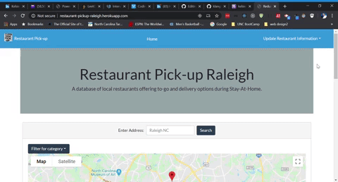

# Curbside-Pickup-Raleigh

Want to still enjoy your favorite restaurants during the shelter-in-place order?  Check out this site to find restaurants in Raleigh, NC offering curbside pickup.

# Technologies

This group project was built with Create-React-app using googleapi and bootstrap.  Loading the app displays participating restaurants within a 20 mile radius providing menus, store hours and other pertinent information about the restaurants.  You can also search your favorite restaurants to see if they have a curbside option.

# Here's a look
https://restaurant-pickup-raleigh.herokuapp.com/

## Installation options
1. Fork the respository
1. Use git clone from the CLI to clone the remote repository
